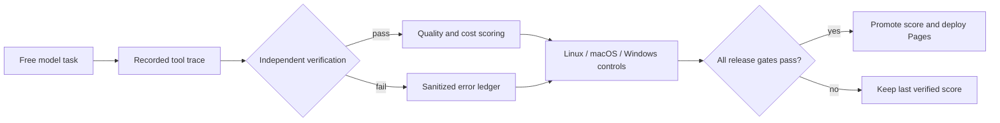

# Circuit-Nova

A task-priced, multi-interface AI agent system: one agent core, driven from a terminal, a desktop
window, and a hosted control plane, where every run states its expected cost in RWF and its maximum
approved spend **before** it executes.

[](https://chrisnkuno.github.io/circuit-agent/)
[](https://github.com/chrisnkuno/circuit-agent/actions/workflows/nova-pages.yml)
[](https://chrisnkuno.github.io/circuit-agent/)

**[Watch Nova work](https://chrisnkuno.github.io/circuit-agent/)** · [inspect the evidence](reliability/latest.json) · [follow daily runs](https://github.com/chrisnkuno/circuit-agent/actions/workflows/nova-reliability.yml)

<!-- nova-reliability:start -->
## Nova scheduled reliability

**91/100 (excellent)** · 6/6 live journeys · 3,117 control tests · 0 failures

Latest run: 2026-09-03 on free model `cohere/north-mini-code:free`. 7.9% tool failure rate · 0% provider failure rate · 100% output-quality checks · 155,232 tokens · 3/3 operating systems. Daily benchmark: code build, responsive web build, debug, scoped search, Defender review, cross-process resume, UI, memory, security, approvals, cost accounting, Exa research, and portability. [Machine-readable evidence](reliability/latest.json).
<!-- nova-reliability:end -->

<details>
<summary><strong>How Nova earns the score</strong></summary>



The score is recomputed from completion, artifact verification, output quality,
tool/provider failures, latency, token economy, prediction calibration, scope,
memory and resume, security, approvals, cost accuracy, UI behavior, portability,
and Exa research evidence. A model cannot promote itself by merely claiming success.

</details>

---

## Repository map

This is a Bun workspace monorepo. Three kinds of thing live here, and the distinction is what keeps
the dependency direction one-way — apps and services depend on packages, never the other way round.

| Path | What it is | Published as |
| --- | --- | --- |
| `packages/agent-core/` | The agent runtime: bounded tool-use loop, provider adapters, workspaces, cost accounting. Everything the surfaces must agree on. | [`@circuit-nova/nova-core`](https://www.npmjs.com/package/@circuit-nova/nova-core) |
| `packages/nova-cli/` | `nova` — the coding agent in your terminal. | [`@circuit-nova/nova-cli`](https://www.npmjs.com/package/@circuit-nova/nova-cli) |
| `packages/nova-state/` | A Rust sidecar: SQLite+FTS5 history index and the Defensive Brain, both rebuildable projections. | `@circuit-nova/state-*` |
| `apps/web/` | The hosted control plane — Next.js site, Convex backend, durable dispatcher. | deployed |
| `services/circuitnotion-relay/` | A Cloudflare Worker giving model calls a different egress path. Deployed on its own. | deployed |
| `tooling/` | Everything that builds, releases, benchmarks and measures the above. Not shipped. | — |
| `reliability/` | The scheduled-evidence corpus and the spectator site built from it. | GitHub Pages |
| `docs/` | See [docs/README.md](docs/README.md). | — |

**Nova Desktop lives elsewhere.** The Tauri app was split out to
[chrisnkuno/nova-desktop](https://github.com/chrisnkuno/nova-desktop), which consumes
`@circuit-nova/nova-core` from npm like any other dependency. A change to how the agent *thinks*
belongs here; a change to how the desktop window *shows* it belongs there.

## Quick start

```bash
bun install
bun run check      # test, typecheck, build — the gate every change has to pass
bun run dev        # the hosted control plane at localhost:3000
bun run nova       # the CLI, straight from source
```

Convex's generated bindings are committed, so typecheck and build work on a fresh clone with no
deployment of your own. [CONTRIBUTING.md](CONTRIBUTING.md) is the full path from a clone to a pull
request; it is worth reading before the first one.

## Where to go next

| If you want to | Read |
| --- | --- |
| Install and use the CLI | [docs/guides/install-nova-cli.md](docs/guides/install-nova-cli.md) |
| Understand the whole system | [docs/architecture/nova-system.md](docs/architecture/nova-system.md) |
| Understand the hosted platform's contracts | [docs/architecture/hosted-platform.md](docs/architecture/hosted-platform.md) |
| Contribute code | [CONTRIBUTING.md](CONTRIBUTING.md) |
| Turn on an integration | [docs/guides/activation.md](docs/guides/activation.md) |
| Know what is built and what is merely written | [docs/planning/implementation-status.md](docs/planning/implementation-status.md), [docs/planning/gap-register.md](docs/planning/gap-register.md) |
| Know what is not built yet | [docs/planning/product-backlog.md](docs/planning/product-backlog.md) |
| Report a vulnerability | [SECURITY.md](SECURITY.md) |

## Pricing, in one paragraph

The web workspace can automatically infer a coarse country from deployment metadata or browser locale, and users can override both country and display currency. Quotes and spend are converted with a dated daily rate for presentation; the authoritative cap, reservation, settlement, and audit ledger remain integer RWF amounts. Approval prompts show that RWF ledger amount alongside any conversion.

## License

MIT. See [LICENSE](LICENSE).
